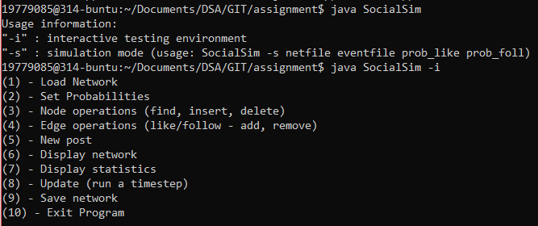

<!--
*** Thanks for checking out this README Template. If you have a suggestion that would
*** make this better, please fork the repo and create a pull request or simply open
*** an issue with the tag "enhancement".
*** Thanks again! Now go create something AMAZING! :D
***
***
***
*** To avoid retyping too much info. Do a search and replace for the following:
*** github_username, repo, twitter_handle, email
-->


<!-- PROJECT SHIELDS -->
<!--
*** I'm using markdown "reference style" links for readability.
*** Reference links are enclosed in brackets [ ] instead of parentheses ( ).
*** See the bottom of this document for the declaration of the reference variables
*** for contributors-url, forks-url, etc. This is an optional, concise syntax you may use.
*** https://www.markdownguide.org/basic-syntax/#reference-style-links
-->


<!-- PROJECT LOGO -->
<br />
<p align="center">
  <a href="https://github.com/Techypanda/Social-Simulation">
    
  </a>

  <h3 align="center">Social Network Simulation</h3>

  <p align="center">
    This is a Social Network Simulation using DSA Knowledge for my DSA Assignment 2019
    <br />
    <a href="https://github.com/Techypanda/Social-Simulation"><strong>Explore the docs »</strong></a>
    <br />
    <br />
    <a href="https://github.com/Techypanda/Social-Simulation">View Demo</a>
    ·
    <a href="https://github.com/Techypanda/Social-Simulation/issues">Report Bug</a>
    ·
    <a href="https://github.com/Techypanda/Social-Simulation/issues">Request Feature</a>
  </p>
</p>


<!-- TABLE OF CONTENTS -->
## Table of Contents

* [About the Project](#about-the-project)
  * [Built With](#built-with)
* [Getting Started](#getting-started)
  * [Prerequisites](#prerequisites)
  * [Installation](#installation)
* [Usage](#usage)
* [Roadmap](#roadmap)
* [Contributing](#contributing)
* [License](#license)
* [Contact](#contact)
* [Acknowledgements](#acknowledgements)


<!-- ABOUT THE PROJECT -->
## About The Project

[![Product Name Screen Shot][product-screenshot]](https://example.com)

It is a Social Network simulation, you can use it in interactive mode or simulation mode.


### Built With

* Editor: Atom
* Compiled With: Uncompiled, source code.
* No makefile.


<!-- GETTING STARTED -->
## Getting Started

Clone this git repo
Compile with your choice of compiler.
Run it.

### Prerequisites

* Java SDK
```sh
javac *.java
java SocialSim (FLAGS)
```
<!--
### Installation
 
1. Clone the repo
```sh
git clone https://github.com/github_username/repo.git
```
2. Compile and Run
```sh
javac *.java
java SocialSim (FLAGS)
```
-->


<!-- USAGE EXAMPLES -->
## Usage

Open your terminal of choice, type ```java SocialSim (FLAGS)```

<!-- ROADMAP -->
<!--
## Roadmap

See the [open issues](https://github.com/github_username/repo/issues) for a list of proposed features (and known issues).


-->
<!-- CONTRIBUTING -->
## Contributing

Contributions are what make the open source community such an amazing place to be learn, inspire, and create. Any contributions you make are **greatly appreciated**.

1. Fork the Project
2. Create your Feature Branch (`git checkout -b feature/AmazingFeature`)
3. Commit your Changes (`git commit -m 'Add some AmazingFeature'`)
4. Push to the Branch (`git push origin feature/AmazingFeature`)
5. Open a Pull Request


<!-- LICENSE -->
## License

Distributed under the MIT License. See `LICENSE` for more information.


<!-- CONTACT -->
## Contact

Jonathan Wright - [@twitter_handle](https://twitter.com/techypanda2) - Twitter

Project Link: [https://github.com/Techypanda/Social-Simulation](https://github.com/Techypanda/Social-Simulation)


<!-- ACKNOWLEDGEMENTS -->
## Acknowledgements

* myself
* me
* oh and I
* Only me this time.


<!-- MARKDOWN LINKS & IMAGES -->
<!-- https://www.markdownguide.org/basic-syntax/#reference-style-links -->
[contributors-shield]: https://img.shields.io/github/contributors/othneildrew/Best-README-Template.svg?style=flat-square
[contributors-url]: https://github.com/Techypanda/Social-Simulation/graphs/contributors
[forks-shield]: https://img.shields.io/github/forks/othneildrew/Best-README-Template.svg?style=flat-square
[forks-url]: https://github.com/Techypanda/Social-Simulation/network/members
[stars-shield]: https://img.shields.io/github/stars/othneildrew/Best-README-Template.svg?style=flat-square
[stars-url]: https://github.com/Techypanda/Social-Simulation/stargazers
[issues-shield]: https://img.shields.io/github/issues/othneildrew/Best-README-Template.svg?style=flat-square
[issues-url]: https://github.com/Techypanda/Social-Simulation/issues
[license-shield]: https://img.shields.io/github/license/othneildrew/Best-README-Template.svg?style=flat-square
[license-url]: https://github.com/Techypanda/Social-Simulation/blob/master/LICENSE
[linkedin-shield]: https://img.shields.io/badge/-LinkedIn-black.svg?style=flat-square&logo=linkedin&colorB=555
[linkedin-url]: https://www.linkedin.com/in/jonathan-i-wright/
[product-screenshot]: images/logo.png
